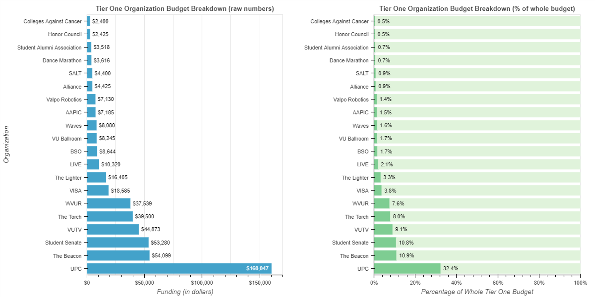

# redesign1
First graphic redesign project for my 2018 statistics colloquium class.
I implemented my team's design ideas using the Bokeh plotting library.

This is the final redesigned graphic:

This is the original graphic that we were given to redo. It is from Valparaiso University's weekly newspaper, The Torch.
http://www.valpotorch.com/eedition/page_92105f33-314f-5fc2-9fa4-380c09398a28.html

